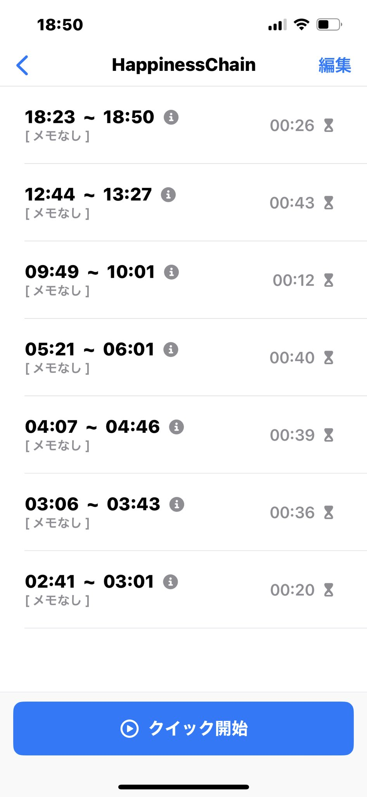

# 2023/8/12 Happiness Chainでの学習4日目

## 取り組んだ課題一覧
- progate Ruby on Rails  IV, V

## 本日作成したQiita記事URL
https://qiita.com/ooyy0121/items/b5140c7210df1c976bf4

## わかったこと
- 投稿機能、削除機能などのコードの中身の書き方。ほかの学習に入ったら忘れそうなのでメモしました。

## 明日やること
- Progate Rails続き

## 感じたこと
-
## 学習時間
今日の勉強時間 h  
累計学習時間　13h

