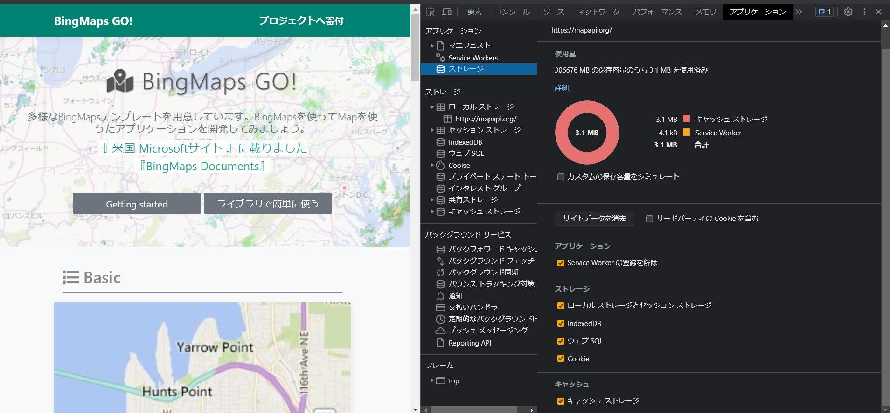

# 2023/8/17 Happiness Chainでの学習9日目

※ この日報はvimで操作を練習しながら書いています

## 取り組んだ課題一覧
-
- この日報をvimの操作を練習しながら書く
- 米国AI開発者がゼロから教えるDocker講座視聴 |
- TOEIC HUNTER (20分音読　毎日固定)
- 寿司打〜5000円コース
- デベロッパーツールの使い方
## 本日作成した or 編集したQiita記事URL
なし
## わかったこと
- 表示しているサイトのCasheデータを削除 

## 明日やること
- デベロッパーツールの使い方(ハンズオン)

## 感じたこと
- 朝一番の学習は時間当たりの作業量と集中力が高く、そして楽しく学習できるという有意義な時間の使い方だなと再確認した。逆に仕事終わりの疲れ切った脳の状態で学習しても頭に入らないし楽しくないのでできるだけ避ける。
## 学習時間
本日の学習時間 h　  
HC | 累計学習時間 38.5h (2023/8/9 ~ 現在)

独学 | 累計学習時間 500h (2023/3 ~ 8/8)

