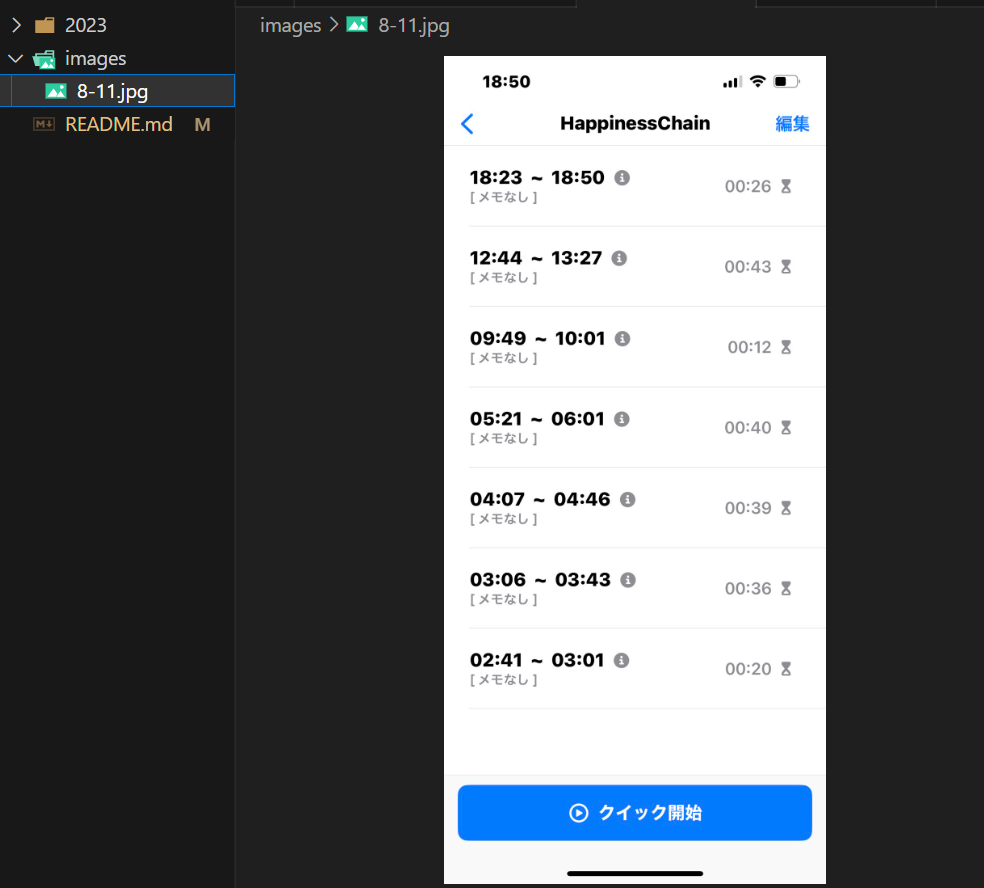

### Githubレポジトリ　URL
https://github.com/okuyama-code/daily_report/tree/main/2023/08

### 拡張機能　Paste Imageの使い方
Windowsのやり方　 
画像ファイルを選択　 
ctrl + c　でコピー  
ctrl + v　貼り付けたい場所へ

vim操作 https://qiita.com/ooyy0121/items/383aa98d7d5c17a1278c
